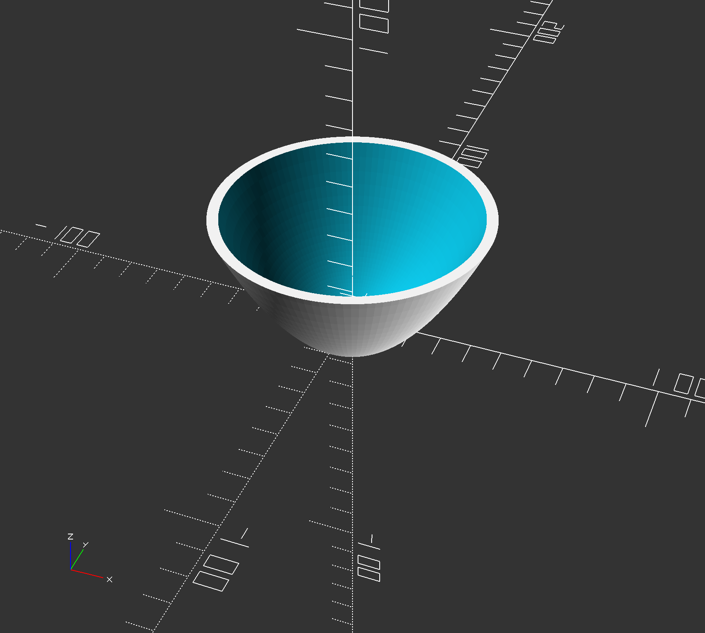

# Parabolic Mirror Mold

This parabolic mirror mold was created for the sustainable energy project of the [Enviormental Science: Resources](https://www.dalton.org/page/high-school-curriculum-detail?fromId=232376&LevelNum=166&DepartmentId=1971) class.

It is written in OpenSCAD.

## Building
A prebuilt STL version is available on the [Releases](https://github.com/nywillb/parabolic-mirror/releases) page.

First, download and install OpenSCAD at [openscad.org](http://openscad.org), then open the [mold.scad](./mold.scad) file in OpenSCAD. Press <kbd>F6</kbd> or go to Design > Render to render a copy of the design. Once the render is complete, go to File > Export to export a built copy.

## Contributing
Pull requests are welcome.

## License
© 2019 William Barkoff, Caitlin Monsky, Matteo Bertoni 

Licensed under the MIT license.